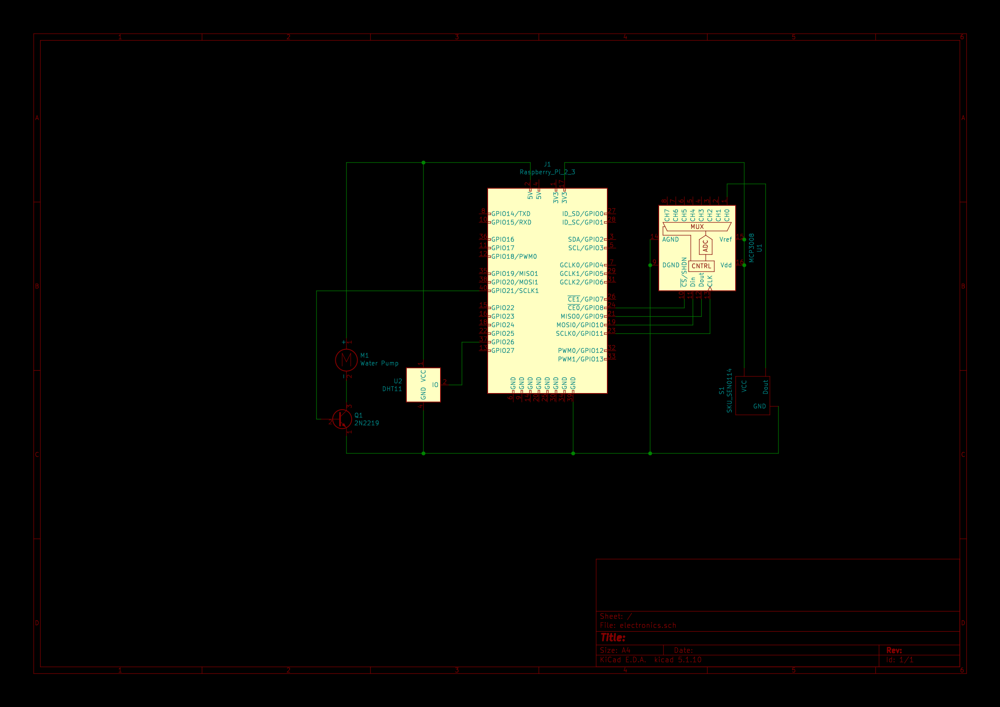

# Plant Waterer

TODO

- [x]  transfer software to pi zero
- [x]  design and print pot housing
- [x]  solder to protoboard

## Hardware 🔨

---

### Electrical

- Raspberry Pi
- DHT11 (temperature and humidity sensor)
- 5V DC motor submersible pump
- 2N222 transistor
- SKU: SEN0114 (soil moisture sensor)
- MCP3008 chip (analogue to digital converter)



### Mechanical

-

## Software 🍦

---

### Dependencies

- RPi.GPIO
- adafruit DHT  — pip3 install adafruit-circuitpython-dht
- adafruit MCP3XXX — sudo pip3 install adafruit-circuitpython-mcp3xxx

### Usage

```bash
python main.py
```

### Sensor Classes

General-purpose object-oriented sensor wrappers that simplify porting to other projects.

motor.py

```python
import time
import RPi.GPIO as GPIO

class Motor():
    def __init__(self, pin) -> None:
        self.pin = pin
        GPIO.setmode(GPIO.BCM)
        GPIO.setup(pin, GPIO.OUT)
        self.off()

    def on(self):
        self.active = True
        GPIO.output(self.pin, 1)

    def off(self):
        self.active = False
        GPIO.output(self.pin, 0)

    def loop(self):
        while True:
            time.sleep(1)
            self.on()
            time.sleep(1)
            self.off()
```

temphumid.py

```python
import adafruit_dht
import board
import time

class TempHumidSensor():
    def __init__(self, ada_pin) -> None:
        self.pin = ada_pin
        self.sensor = adafruit_dht.DHT11(self.pin, use_pulseio=False)

    def read(self) -> tuple:
        try:
            # Print the values to the serial port
            temp = self.sensor.temperature
            humidity = self.sensor.humidity
            return temp, humidity

        except RuntimeError as error:
            # Errors happen fairly often, DHT's are hard to read, just keep going
            print(error.args[0])
        except Exception as error:
            self.sensor.exit()
            raise error

        return None, None

    def loop(self):
        while True:
            time.sleep(1)
            print(self.read())
```

moisture.py

```python
import sys
import time
import pickle
import busio
import digitalio
import board
import adafruit_mcp3xxx.mcp3008 as MCP
from adafruit_mcp3xxx.analog_in import AnalogIn

class MoistureSensor():
    def __init__(self) -> None:
        # CLK = 11
        # MISO = 9
        # MOSI = 10
        # CS = 25
        # INPUT_PIN = 0
        
        # create the spi bus
        spi = busio.SPI(clock=board.SCK, MISO=board.MISO, MOSI=board.MOSI)
        
        # create the cs (chip select)
        cs = digitalio.DigitalInOut(board.D25)
        
        # create the mcp object
        mcp = MCP.MCP3008(spi, cs)
        
        # create an analog input channel on pin 0
        self.chan = AnalogIn(mcp, MCP.P0)
        self.read()

    def read(self):
        """Reads from the soil moisture sensor via the MCP3008 analogue to digital converter,
        maps raw value to the sensoterra index and updates the multiprocessing global.
        """
        moisture_reading = self.chan.value
        self.adjusted_reading = self.linear_sensoterra_map(moisture_reading)
        return self.adjusted_reading

    def linear_sensoterra_map(self, value):
        """Takes the bit data returned by the analogue to digital converter connected to the analogue soil 
        moisture sensor and maps the value to within the sensoterra index range (0-10) as a standard
        measure of soil moisture.

        :param value: Raw bits in the range of 0 to 1024 indicating soil moisture level.
        :type value: int
        :return: Remapped soil moisture reading.
        :rtype: float
        """
        old_min = 0
        old_max = 65472
        new_min = 0
        new_max = 10
        sensoterra_value = (value - old_min)/(old_max -
                                              old_min) * (new_max - new_min) + new_min
        return sensoterra_value

    def loop(self):
        while True:
            time.sleep(.5)
            print(self.read())
```
