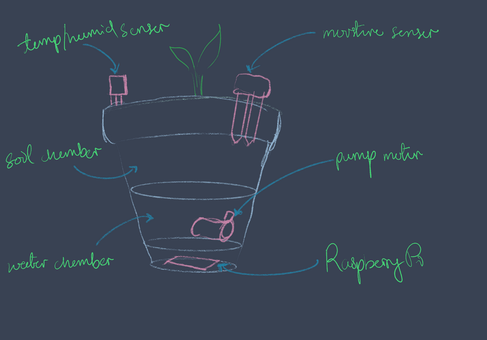

---

# Hardware

- 3D printed pot or three-stacked pots

- Raspberry Pi (any regular or Zero model will do)

- DHT11 (temperature and humidity sensor)

- 5V DC submersible pump motor and some vinyl tubing (cheap and available fish tank parts)

- 2N222 transistors

- SKU: SEN0114 (analogue soil moisture sensor like this)

- MCP3008 chip (analogue to digital converter)

---

# Dependencies

adafruit DHT
```bash 
pip3 install adafruit-circuitpython-dht
```

adafruit MCP3XXX

```bash
sudo pip3 install adafruit-circuitpython-mcp3xxx
```

---

# Code

https://github.com/yohanderose/PlantBabyMonitor-IOT

https://yohanderose.dev/plant-baby-monitor/

Copy-paste the above modular object oriented classes for *abstracted*, *performant* and *easily extensible* component control

```python
from motor import Motor
from temphumid import TempHumidSensor
from moisture import MoistureSensor

```

---


```python
temphumid_sensor = TempHumidSensor(TEMPHUMID_PIN)
moisture_sensor = MoistureSensor()
pump = Motor(MOTOR_PIN)

def main():
    while True:
        t, h = temphumid_sensor.read()
        m = moisture_sensor.read() 
        if m < 6:
            pump.on()
            time.sleep(5)
            pump.off()
```
---

# Extensions (ooh aah)

Concurrency and state management

Flask web server for data visuals and remote control

- Public IP Address
- AWS GreenGrass
- VPS

PID control for state maintenance

- Observe moisture and temperature fluctuation
- Test P, I and D values as they influence yield
